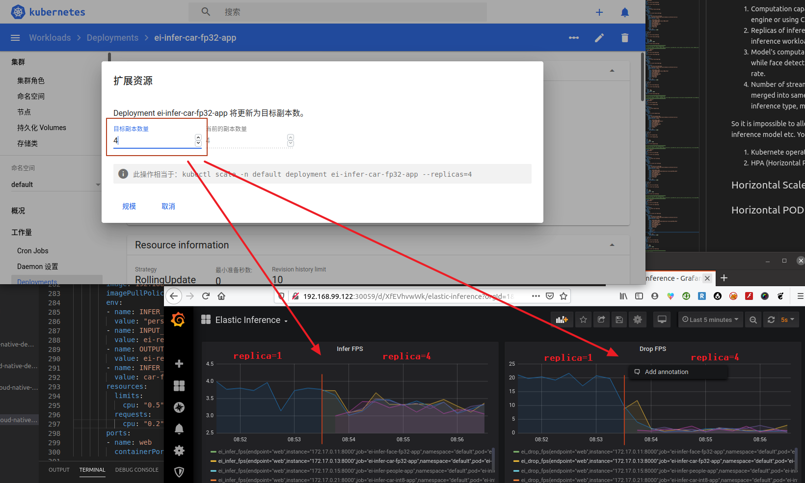
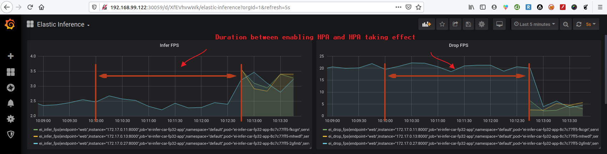

# Dynamic Scale Inference Engine to Improve Inference Performance

As mentioned in [Inference Metrics](inference_metrics.md), the inference performance might be impacted by

  1. Computation capacibility of inference engine. Inference engine might be accelerated by heterogonous engine or using CPU SIMD instruction like AVX512 VNNI.
  2. Replicas of inference engine for same inference workload. Operator can scale more replicas to balance inference workloads. More replicas, less inference rate for single replica.
  3. Model's computation requirement. For example, object detection may need 20 GFlops computation while face detection might only need 0.5G Flops. More computation of model will result less inference rate.
  4. Number of streams for same inference type. Because the streams with same inference type were merged into same queue and will be handled by same inference service. So more streams with same inference type, more drop frames.

So it is impossible to allocate fixed computation resource for dynamic workloads like number of streams, inference model etc. You can use horizontal scaling approach to improve:

  1. Kubernete operator can do horizontal scale via ```kubectl``` command or via dashboard
  2. HPA (Horizontal POD Autoscaler) base on [Inference Metrics](inference_metrics.md)

## Horizontal Scale Manually

You can scale the deployment of inference engine via command:

```
kubectl scale --replicas=4 deploy/ei-infer-car-fp32-app
```

Or do it via kubernetes-dashboard as follows:



From above result, after replicas scale up from 1 to 4, the infer FPS was up 4 times and drop FPS was reduced much.

## Horizontal POD Autoscaler

Please get detail about HPA(Horizontal POD Autoscaler) from [kubernete offical document](https://kubernetes.io/docs/tasks/run-application/horizontal-pod-autoscale/).

### Install metrics-server

To enable it, you need install [metrics-server](https://github.com/kubernetes-sigs/metrics-server)

_(Note: Please install via script [install-metric-server.sh](../tools/install-metric-server.sh) or refer below steps.)_

```
git clone https://github.com/kubernetes-sigs/metrics-server
kubectl apply -f metrics-server/deploy/kubernetes/
```

After 1~5 minutes, you should able to get resource usage via following commands
```
kubectl top pod
```

If meeting with error on some kubernete like v1.16.0, please add mentioned [here](https://github.com/kubernetes-sigs/metrics-server/issues/300#issuecomment-568926110)

```
diff --git a/deploy/kubernetes/metrics-server-deployment.yaml b/deploy/kubernetes/metrics-server-deployment.yaml
index e4bfeaf..87ca94f 100644
--- a/deploy/kubernetes/metrics-server-deployment.yaml
+++ b/deploy/kubernetes/metrics-server-deployment.yaml
@@ -33,6 +33,8 @@ spec:
         args:
           - --cert-dir=/tmp
           - --secure-port=4443
+          - --kubelet-insecure-tls=true
+          - --kubelet-preferred-address-types=InternalIP
         ports:
         - name: main-port
           containerPort: 4443
```

## Enable HPA with default CPU metrics

Auto scale need base on the specific metrics like CPU usage like below

```
kubectl autoscale deployment ei-infer-car-fp32-app --cpu-percent=80 --min=1 --max=4
```

or

```
cd cloud-native-demo/elastic_inference/kubernetes/monitoring
kubectl apply -f hpa-infer-car-fp32-on-metric-cpu.yaml
```

After few minutes (4~10minutes), the replicas of ei-infer-car-fp32-app will be scaled up, so inference FPS was improved and drop FPS was reduced.



_(Note: This is an example, please change the deployment name from ei-infer-car-fp32-app to others if need)_

_(Note: The autoscaling version v1 in [hpa-infer-car-fp32-on-metric-cpu.yaml](../kubernetes/scale/hpa-infer-car-fp32-on-metric-cpu.yaml) was tested on kubernetes v1.16.0, please use ```kubectl api-versions``` to check your API version for autoscaling then change accordingly.)_

CPU metric might not reflect the inference performance, so please refer [HPA base on custom inference metics](hpa_on_custom_metrics.md) for advanced HPA feature.