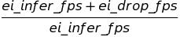
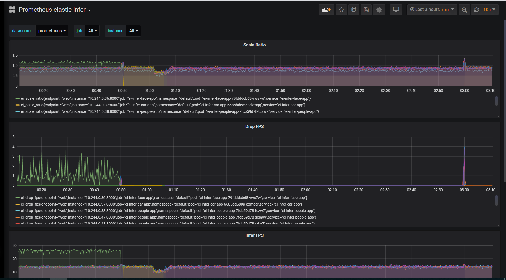
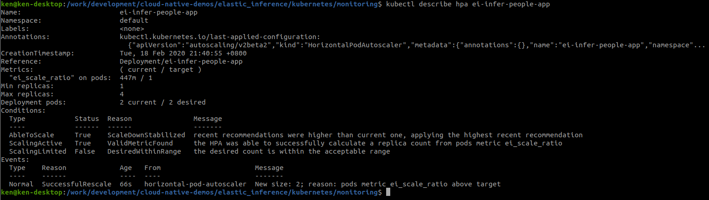
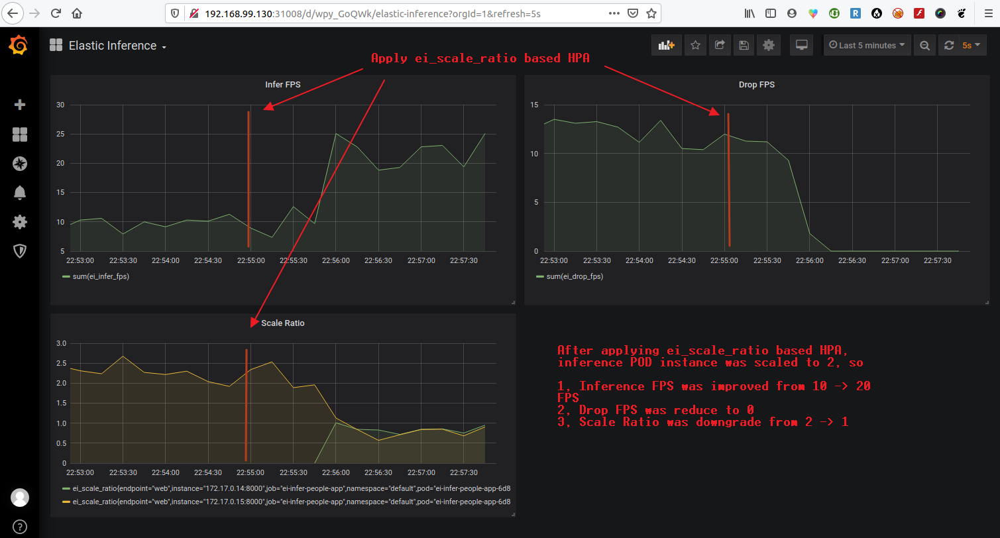

# HPA(Horizontal POD Autoscaler) on Custom Metrics

HPA basing on CPU usage metric might not demostrate real inference perfromance impact or improvement, which indicated by [inference metrics](inference_metrics.md). 

So we used the custom metric ei_scale_ratio as follows could give better scaling result:



This metric was exposed by each indivual inference engine as below:



If ei_scale_ratio = 2, means need use two replicas of inference engine to reduce drop FPS.

## Install [Kube-Prometheus](inference_metrics.md#install-kube-prometheus)

## Install k8s-prometheus-adapter

_(Note: you can also use [install-k8s-prometheus-adapter.sh](../tools/install-k8s-prometheus-adapter.sh) or refer below steps.)_

1. Create namespace `custom-metrics`

```
kubectl create namespace custom-metrics
```

2. Create a secret `cm-adapter-serving-certs`

```
export PURPOSE=serving
openssl req -x509 -sha256 -new -nodes -days 365 -newkey rsa:2048 -keyout ${PURPOSE}-ca.key -out ${PURPOSE}-ca.crt -subj "/CN=ca"
echo '{"signing":{"default":{"expiry":"43800h","usages":["signing","key encipherment","'${PURPOSE}'"]}}}' > "${PURPOSE}-ca-config.json"
kubectl -n custom-metrics create secret tls cm-adapter-serving-certs --cert=./serving-ca.crt --key=./serving-ca.key
```

3. Clone k8s-prometheus-adapter version v0.5.0

```
git clone https://github.com/directxman12/k8s-prometheus-adapter.git -b v0.5.0
```

4. Update custom-metrics-apiserver-deployment.yaml

```
diff --git a/deploy/manifests/custom-metrics-apiserver-deployment.yaml b/deploy/manifests/custom-metrics-apiserver-deployment.yaml
index b36d517..7a94ea7 100644
--- a/deploy/manifests/custom-metrics-apiserver-deployment.yaml
+++ b/deploy/manifests/custom-metrics-apiserver-deployment.yaml
@@ -22,10 +22,10 @@ spec:
         image: directxman12/k8s-prometheus-adapter-amd64
         args:
         - --secure-port=6443
-        - --tls-cert-file=/var/run/serving-cert/serving.crt
-        - --tls-private-key-file=/var/run/serving-cert/serving.key
+        - --tls-cert-file=/var/run/serving-cert/tls.crt
+        - --tls-private-key-file=/var/run/serving-cert/tls.key
         - --logtostderr=true
-        - --prometheus-url=http://prometheus.prom.svc:9090/
+        - --prometheus-url=http://prometheus-operated.monitoring.svc:9090/
         - --metrics-relist-interval=1m
         - --v=10
         - --config=/etc/adapter/config.yaml
```
5. Deploy the k8s-prometheus-adapter

```
kubectl create -f deploy/manifests/
```

6. Verify custom metrics

```
kubectl get --raw "/apis/custom.metrics.k8s.io/v1beta1" | jq .
```

You should get full list of custom metrics. If the list is blank, then you may check whether kube-prometheus and k8s-prometheus-adapter are installed correctly.

## Deploy a sample HPA base on ei_scale_ratio

[hpa-infer-people-on-custom-metric-scale-ratio.yaml](../kubernetes/scale/hpa-infer-people-on-custom-metric-scale-ratio.yaml) is a sample for scaling on people inference scale ratio

```
  maxReplicas: 4
  minReplicas: 1
  metrics:
  - type: Pods
    pods:
      metric:
        name: ei_scale_ratio
      target:
        type: AverageValue
        averageValue: 1
```
The replicas will be scaled according to ei_scale_ratio automatically.



Following is the result after applying HPA:




_(Note: Custom metrics based HPA has been tested on kubernetes 1.16.0 and 1.17.0.)_