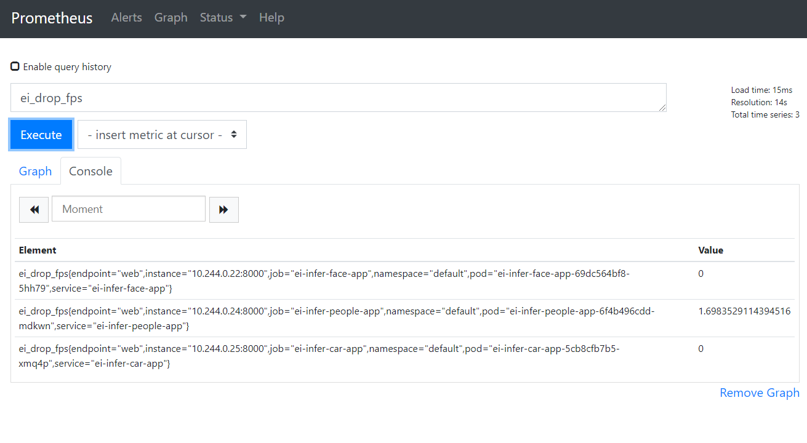

# Monitoring with [`kube-prometheus`](https://github.com/coreos/kube-prometheus)

## Start monitor

```shell
$ git clone https://github.com/coreos/kube-prometheus.git
$ cd kube-prometheus
$ git checkout -b v0.3.0 v0.3.0
```

First start the kube-prometheus, just make minor change to export Grafana and Prometheus
service as NodePort for accessing easily. For example,

* grafana -- 31008
* prometheus-k8s -- 31009

```shell
diff --git a/manifests/grafana-service.yaml b/manifests/grafana-service.yaml
index 3acdf1e..6587f02 100644
--- a/manifests/grafana-service.yaml
+++ b/manifests/grafana-service.yaml
@@ -6,9 +6,11 @@ metadata:
   name: grafana
   namespace: monitoring
 spec:
+  type: NodePort
   ports:
   - name: http
     port: 3000
     targetPort: http
+    nodePort: 31008
   selector:
     app: grafana
diff --git a/manifests/prometheus-service.yaml b/manifests/prometheus-service.yaml
index 4f61e88..56af5ce 100644
--- a/manifests/prometheus-service.yaml
+++ b/manifests/prometheus-service.yaml
@@ -6,10 +6,12 @@ metadata:
   name: prometheus-k8s
   namespace: monitoring
 spec:
+  type: NodePort
   ports:
   - name: web
     port: 9090
     targetPort: web
+    nodePort: 31009
   selector:
```

```shell
$ kubectl create -f manifests/setup/
$ kubectl create -f manifests/
```

Now start the demo.
Then start the servicemonitor.yaml.

` $ kubectl create -f servicemonitor.yaml `
 
Wait for a while, you will see three new discovered services in http://${NodeIP}:31009/service-discovery.
Now you can try play with prometheus and grafana for the demos reported metrics.

` ei_drop_fps `

` ei_infer_fps `



## HPA ( Horizontal Pod Autoscaler )

To try HPA, usually the [`metrics-server`](https://github.com/kubernetes-sigs/metrics-server) needs to be deployed.
But the kube-prometheus stack includes a resource metrics API server, so the metrics-server addon is not necessary.

* For example, start a HPA based on CPU ratio.

` $ kubectl autoscale deployment ei-infer-people-app --cpu-percent=80 --min=1 --max=4 `


